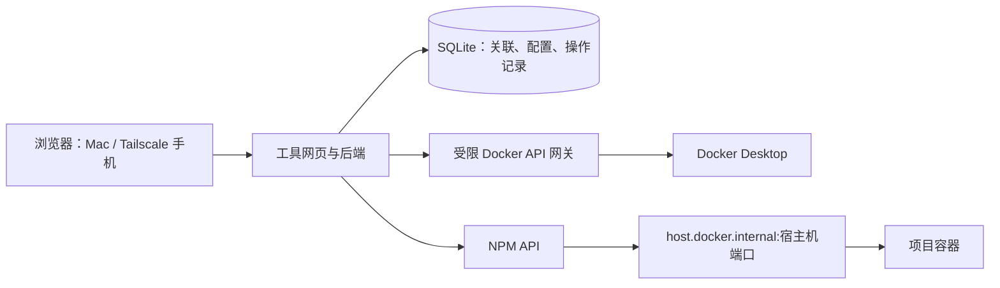

# Docker 项目域名管理工具：项目开发规划

版本：v0.1 · 日期：2026-09-25 · 状态：开发前基线

本文是项目规划，不代表功能已经实现或环境已经变更。暂用项目名“项目域名管理器”，正式名称可在界面设计阶段确定。

## 1. 项目目标与已确认约束

在 Mac mini 上通过原始 Docker Compose 部署项目后，用户进入网页管理工具，选择 Web 服务、填写子域名，即可自动配置 Nginx Proxy Manager（NPM）并复用现有证书。支持后续编辑、停用与恢复，手机端也能操作。

保留现有 Docker Desktop、Docker Compose、Tailscale 和 NPM。用户继续自行部署、更新和停止业务项目，工具只管理域名访问入口。

### 已核实的环境

| 项目 | 当前事实 | 设计影响 |
| --- | --- | --- |
| Docker | Docker Desktop，使用 Compose | 通过 Docker API 读取项目、服务及端口 |
| DNS | `*.muto404.com` 解析至 Mac 的 Tailscale IP | 常规新增入口不创建 DNS 记录 |
| 证书 | NPM 已有 `*.muto404.com` 与 `muto404.com` 的有效证书，使用 Cloudflare DNS 验证 | 工具绑定证书，申请和续期仍由 NPM 承担 |
| NPM | v2.16.0，作为容器运行 | 首个明确支持的接口版本 |
| 代理方式 | 已使用 `host.docker.internal` 转发宿主机端口 | 第一版采用该方式 |
| 网络 | NPM 与业务项目属于不同 Compose 网络 | 不要求现有业务项目迁移网络 |
| 现有规则 | 有一条有效配置记录，测试入口转发至宿主机 9999 端口 | 初次接入只读展示，不自动接管 |
| 运行状态 | 核查时仅 NPM 运行，现有业务容器停止，9999 端口未响应 | 运行状态不能当作永久环境事实 |

DNS 来自权威解析查询；证书和代理来自 NPM 页面与本地只读核查。开发前重新检查动态状态。现有 NPM 镜像使用 `latest`，工具对版本变化要有兼容性检测；本项目不自动升级 NPM。

## 2. 产品范围与成功标准

### v1 必须具备

1. 初始化向导：配置 NPM 地址与凭据、默认域名、默认转发主机、默认通配符证书。
2. Docker 发现：按 Compose 项目分组，显示运行和停止的服务、映射端口及状态；允许手动添加端口入口。
3. 创建入口：输入子域名前缀，选择服务与宿主机端口，预览完整地址并保存。
4. 入口管理：查看、修改域名/目标/协议/WebSocket 设置，启用、停用、归档及恢复。
5. 已有规则：只读展示，可由用户显式接管后编辑；未接管规则不自动写入。
6. 证书：显示覆盖范围、到期时间和绑定关系；证书不匹配时阻止应用。
7. 检查：展示 DNS、证书、规则应用和后端响应状态，给出可操作的错误信息。
8. 操作记录：保存变更前后快照、执行结果和时间，支持工具发起的规则修改回退。
9. 手机适配：核心创建与编辑流程可在窄屏完成。
10. 持久化与备份：工具重启不丢失入口关联、设置与操作记录。

### 本期不包含

项目部署/升级/停止、Compose 文件改写、Docker 网络变更、Cloudflare DNS 写入、证书签发/续期、TCP/UDP 入口、路径级复杂路由、多用户权限体系、多 Docker 主机和多 NPM 实例。NPM 高级自定义配置本期只读保留，不自动解释或改写。

“删除入口”在 v1 中定义为：停用 NPM 规则并在工具内归档，可恢复；不删除容器、业务数据、证书或 DNS。永久删除 NPM 规则留待后续版本。

### 核心验收标准

- 已完成初始化、项目有明确映射端口时，正常新增入口只需“选择服务、填写名称、保存”。
- 单个服务有多个候选端口时要求选择，不能把数据库端口自动当成网站。
- `18080:3000` 必须生成 `host.docker.internal:18080`，不得误用内部端口 `3000`。
- 重复提交不产生重复规则；已有同域名、重叠通配符及停用规则都纳入冲突检查。
- 域名规则写入成功与应用已响应分别显示；应用返回 401/403 等响应不简单判成网络故障。
- 业务容器停止、删除或重建不会自动删除代理规则；重新发现使用稳定关联，不依赖容器 ID。
- 未接管的 NPM 规则和高级字段不会被静默覆盖。
- 整个工具不持有 Cloudflare DNS Token，不下载或存储证书私钥。

## 3. 用户流程与页面

### 初始化

登录工具 → 检查 Docker 连接 → 检查 NPM 版本和登录 → 选择证书 → 设置默认域名及转发主机 → 查看现有入口 → 完成。

NPM 凭据尚未取得，也未验证真实账号的权限边界。开发使用隔离测试实例；首次正式接入时通过设置界面输入凭据，不提取浏览器登录会话。

### 创建入口

项目列表 → 选择 Web 服务 → 填写名称 → 确认宿主机映射端口与协议 → 保存 → 查看执行阶段与访问链接。

工具根据 Compose 项目名、服务名和端口识别目标。无法确定唯一目标时，保留现有规则并提示用户选择。多副本和多个绑定地址不会自动选取第一个。

### 编辑与接管

已有规则默认只读。用户选择“接管”后，保存其 NPM ID 和初始快照。编辑时先拉取当前规则；如与上次读取的版本不同，提示重新加载或对比后再提交，禁止静默覆盖外部修改。

### 页面清单

| 页面 | 核心内容 |
| --- | --- |
| 项目 | 按项目分组的服务、运行状态、候选端口、已有入口与绑定按钮 |
| 入口 | 域名、目标、证书、启用状态、检查状态、管理归属 |
| 新增/编辑 | 子域名、目标服务或手动端口、协议、证书、WebSocket、结果预览 |
| 入口详情 | 操作历史、检查结果、冲突信息、回退及恢复 |
| 设置 | Docker/NPM 连接状态、默认值、凭据更新、备份说明 |

HTTP/HTTPS 后端协议、WebSocket 等选项放入高级设置。默认入口使用浏览器信任的 HTTPS，HTTP 跳转由 NPM 处理。当前 NPM 的容器 80 映射到宿主机 8080，因此不能假设 `http://子域名` 能进入 NPM；v1 直接提供 HTTPS 链接，不调整现有端口。

## 4. 推荐技术架构

采用单仓库、单应用容器与 SQLite，避免引入额外数据库服务。建议 TypeScript、React + Vite 前端、Fastify 后端、Zod 数据校验；具体库版本在开发启动时选择稳定版本并锁定。

浏览器只访问工具后端，不直接访问 Docker API，也不保存 NPM 密码或令牌。前后端同源部署。

### Docker 适配器

- 读取容器摘要及经过筛选的详细信息、Compose 标签、运行状态和端口绑定。
- 仅启用需要的读取端点，优先通过隔离的 Docker API 网关连接；网关不向宿主机或 Tailscale 发布端口。
- 不提供容器创建、执行命令、挂载、启动/停止或网络修改能力。
- `docker.sock:ro` 不等于 Docker API 只读权限；不能以此作为权限隔离方案。
- Docker inspect 可能含环境变量秘密，后端不记录原始返回值，前端只获得必要字段。
- 以手动刷新和低频轮询为 v1 基线；Docker 事件监听可作为后续优化。

### NPM 适配器

- 封装登录、令牌刷新、规则查询/创建/修改/启停和证书元信息查询。
- 所有写入经过 NPM API，不直接改数据库或生成的 Nginx 文件。
- 对接已安装的 v2.16.0；未知版本显示兼容性提示，读操作可继续，写操作须通过兼容检查。
- 请求有超时、结构校验和脱敏日志。写请求超时后先查询实际状态，不能盲目重试创建。
- 更新尽量只改变工具管理的字段；若接口要求全量提交，基于最新原始对象合并，并验证未改字段保留。

### 端口与连通性策略

第一版支持 NPM 可达的宿主机发布端口。`127.0.0.1` 专属绑定、UDP、无发布端口、非 HTTP 服务均不能默认认定可用；给出解释并允许选择受支持目标。工具不会为项目偷偷修改端口映射。

主检查从工具容器访问后端，另通过 NPM 实际代理入口验证整条代理路径。代理测试显式连接本地 NPM 的 TLS 端口，并使用目标域名作为 SNI/Host，保持证书校验，不假定工具容器能访问宿主机 Tailscale 地址。

页面分别显示：DNS 解析结果、TLS 有效性、NPM 规则是否生效、HTTP 响应。手机端通过 Tailscale 的完整访问需由实际手机确认，不能以本机检查代替。外部身份认证或特殊应用路径导致检查不完整时显示“需人工验证”。

## 5. 数据模型与一致性

| 实体 | 主要内容 |
| --- | --- |
| settings | 域名、NPM 地址、默认目标、证书 ID、检查策略 |
| credentials | 加密后的 NPM 凭据，密钥单独通过运行时文件提供 |
| bindings | 内部 ID、NPM 规则 ID、域名、Compose 项目/服务、目标端口、管理归属、归档状态 |
| operations | 幂等标识、动作、阶段、前后快照、结果、错误信息 |
| observations | NPM 对象指纹、上次同步时间及检查结果 |

SQLite 保存工具意图与关联；NPM 是实际代理状态来源；Docker 是容器状态来源。每次写入前重新核对外部实际状态。

写入流程：输入校验 → 最新状态及冲突检查 → 记录待执行操作 → 调用 NPM → 回读核对 → 记录已应用 → 进行连通性检查。

同一规则串行修改，创建操作使用稳定幂等标识。工具重启后对未完成操作先做状态对账。NPM API 无法与 SQLite 组成单一数据库事务，采用操作日志和补偿机制；外部 NPM UI 同时修改的竞争无法完全消除，必须回读检查并提示冲突。

代理写入失败时尝试恢复该操作的配置快照；如补偿也失败，明确标记“需要处理”并展示恢复动作。仅后端健康检查失败不自动撤销已保存规则，以支持服务稍后启动。回退前再次检查外部变化，避免覆盖他人后续修改。

## 6. 最小安全与运行设计

- 仅供本人使用，提供单管理员登录、哈希密码、HttpOnly 会话 Cookie、CSRF 防护与登录限速；管理地址从 Tailscale 访问。
- 管理员密码与 NPM 凭据通过本地初始化输入，不写入 Git、构建产物、浏览器存储或日志。
- NPM API 权限取能完成任务的最小范围；具体授权行为在技术验证阶段确认。
- 手动目标限制为预配置转发主机及合法端口，不提供任意 URL 探测；健康检查不跟随跳转到任意主机。
- 工具不把数据库、Docker API 网关等内部端口对外发布。
- 自动操作只针对用户明确绑定的服务，不因发现新容器就发布入口。
- SQLite、凭据密文与密钥分开备份；恢复演练包含密钥恢复。日志有保留上限。
- 工具自身入口采用独立引导配置并禁止在普通入口列表中编辑或停用，同时保留本机管理入口作为恢复路径。

## 7. 正式开发流程与阶段门槛

| 阶段 | 工作与交付物 | 通过标准 |
| --- | --- | --- |
| M0 技术验证 | 隔离测试 NPM、Docker 只读连接验证、接口契约、证书元信息、代理探测、账号权限验证 | 能在测试实例完成建/改/停用/恢复，且未改变现有规则；关键接口与错误行为有记录 |
| M1 需求与交互基线 | 确认 PRD、页面线框、错误状态、接管与归档语义、架构决策记录 | 主流程和失败流程都可逐项映射到验收标准 |
| M2 工程基础与只读版本 | Git 仓库、开发说明、锁文件、CI、Docker 构建、数据库迁移、登录、项目列表、规则列表 | 在 Mac 本地启动；只读接入现有 NPM；敏感信息不出现在页面/API/日志 |
| M3 核心写入闭环 | 新建、编辑、证书绑定、WebSocket、幂等、外部修改检测、停用/恢复 | 核心集成测试通过；隔离实例中全流程可重复执行 |
| M4 稳定性与体验 | 检查状态、失败恢复、审计、归档、重建识别、移动端、备份恢复 | 异常场景通过；重启不丢状态；无静默覆盖或重复规则 |
| M5 实机验收与交付 | 正式 Compose、安装/升级/回退手册、版本说明、独立测试服务和临时测试域名验证 | Mac 与手机实际 HTTPS 访问成功；已有业务配置保持符合预期；备份恢复演练通过 |

当前只规划，不将“规划完成”等同于进入部署阶段。后续开发按阶段推进；正式环境的写入范围应在测试计划中列明，用户授权后执行。先完成可审阅的代码、测试和部署配置，再进行正式环境接入。

开发工作量初步判断为中等。接口适配、并发一致性和恢复能力是主要不确定项；M0 完成后按实际结果拆分工作量和排期，不以尚未验证的工时承诺上线日期。

### 工程协作与质量要求

- 建立 Git 仓库，功能按小批次分支或提交交付，提交信息说明行为变化。
- TypeScript 类型检查、静态检查、构建和必要自动化测试进入 CI。
- 关键架构决定记录为 ADR：宿主机端口转发、NPM 写入策略、Docker 权限隔离、删除语义。
- PR/变更说明包含问题、实现、验证和迁移影响；无法远程建 PR 时保留本地可审阅提交与差异。
- 使用锁定的依赖与可追溯镜像版本，发布带版本号；正式上线不依赖浮动 `latest` 工具镜像。
- UI 文案以中文为主，技术字段提供简短解释，正常流程不暴露内部 API 或数据库概念。

## 8. 测试与验收矩阵

| 类别 | 必测场景 |
| --- | --- |
| 域名 | 合法名称、空值、非法字符、重复、通配符冲突、已归档规则占用、证书层级不匹配 |
| 端口 | `18080:3000`、多个映射、未发布、仅 UDP、仅回环绑定、停止容器、目标非 HTTP |
| NPM 契约 | 登录/刷新失败、权限不足、版本变化、字段保留、API 成功但配置未正确应用 |
| 一致性 | 重复点击、写入后响应丢失、超时重试、写入中进程重启、外部修改、重复域名竞争 |
| 生命周期 | 容器重建 ID 变化、项目改名、端口变化、容器删除、停止后恢复 |
| 访问 | DNS 正确/覆盖冲突、TLS 有效/过期/域名不匹配、后端拒绝连接、401/403、重定向、WebSocket |
| 管理安全 | 未登录、CSRF、会话过期、敏感字段脱敏、Docker 写接口不可达、任意目标探测被拒绝 |
| 恢复 | 停用/恢复、归档/恢复、修改回退、补偿失败、工具备份恢复、自身管理入口恢复 |
| UI | 桌面与约 390px 窄屏、长项目名、多端口选择、加载/空白/错误状态 |

测试分层：纯逻辑单元测试覆盖域名/端口/状态机；隔离 NPM 与 Docker 测试服务覆盖真实集成；端到端测试覆盖新增、编辑和恢复。手工验收负责手机 Tailscale 链路及视觉检查。测试不使用生产规则作为可销毁数据。

## 9. 发布与回退

1. 发布前备份工具数据和 NPM 数据/证书目录，确认备份可读且恢复方法明确。
2. 固定版本构建 ARM64 镜像；其他架构支持根据实际硬件验证，不默认 Mac 必为 Apple Silicon。
3. 启动工具及隔离 Docker API 网关，完成管理员初始化和只读连接检查。
4. 选择已有通配符证书，核对 DNS，不修改现有 DNS 或证书。
5. 在授权范围内创建独立测试服务与无冲突测试子域名，完成 Mac 和手机验收。
6. 再接管用户选定的现有规则；其余保持只读。
7. 发布说明记录支持的 NPM/Docker Desktop 版本、已知限制及升级步骤。

工具服务故障不应影响已写入 NPM 的业务入口，因为正常流量不经过工具。回退工具版本前检查数据库迁移兼容性；不能直接回退时恢复对应备份。规则回退基于操作快照，不能用整库恢复覆盖后续合法修改。NPM 整体恢复仅作为独立灾难恢复流程。

## 10. 后续开发启动前的待办

以下均为实施期验证项，不要求用户重新决定已经确认的产品方向：

- 检查 Docker Desktop 当前版本、CPU 架构及 socket 可用路径。
- 在测试实例验证 NPM v2.16.0 的认证、权限、更新字段要求与错误响应。
- 确认 Docker API 网关实现和允许读取的最小端点集合。
- 验证从工具容器到 NPM 与 `host.docker.internal` 的连通性。
- 明确现有高级规则、多个域名规则的接管限制；无法无损维护则只读展示。
- 设计单管理员初始化、密钥保存及备份恢复方式。
- 后续由用户在初始化界面提供 NPM 凭据；不在聊天中索取明文密码。
- 实机验收前明确临时服务、临时子域名与清理范围。

## 11. 最终交付清单

- 可运行且有版本标识的源代码仓库。
- Dockerfile、部署 Compose、脱敏配置示例与初始化向导。
- 中文网页：项目发现、入口管理、检查、历史和设置。
- 隔离测试配置、自动化测试与实机验收记录。
- 安装、使用、升级、故障排查、备份恢复和回退文档。
- 架构决策与已知限制清单。

开发完成的定义：不仅能创建一条代理规则，还要能解释失败、避免误覆盖、在容器重建后保持关联，并通过真实手机访问和恢复验证。
